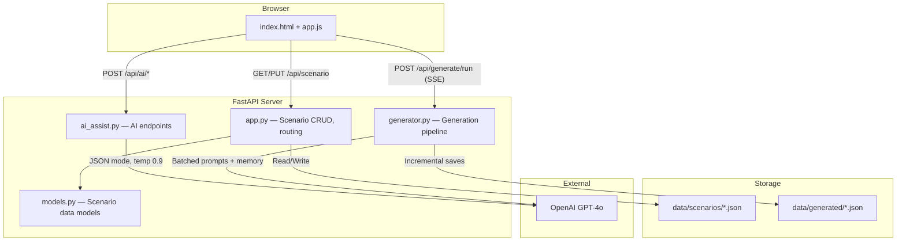
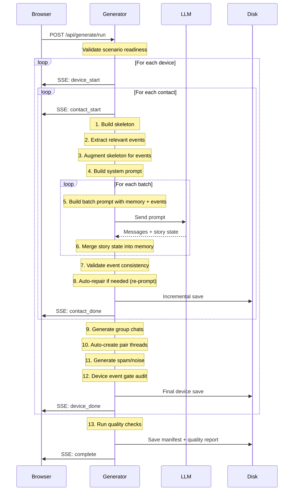
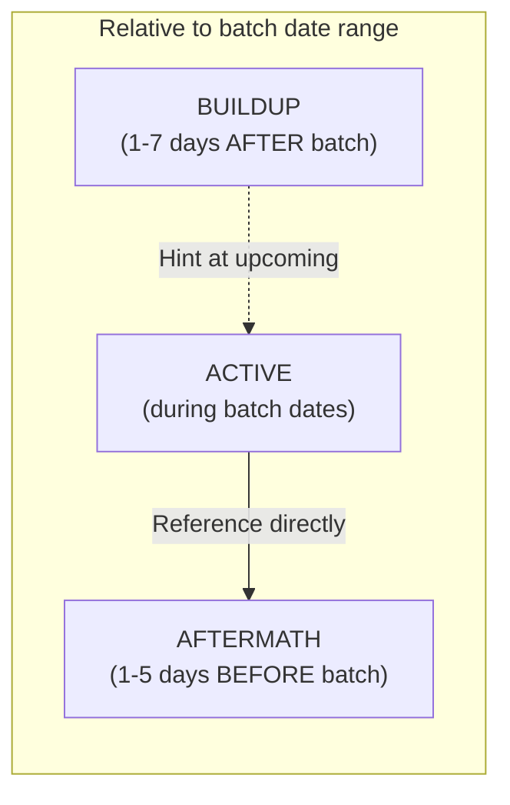
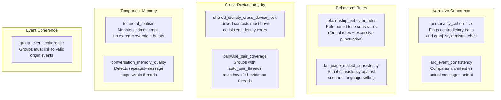
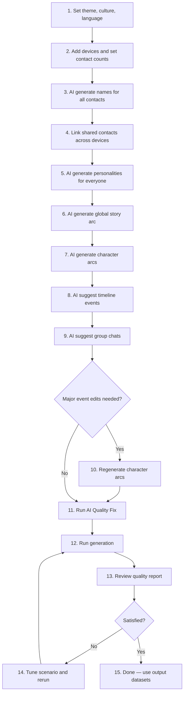

# Synthread Studio — Master System Guide

**An AI-powered studio for generating realistic, multi-device synthetic SMS datasets
with coherent personalities, branching story arcs, and forensic-grade cross-device evidence.**

This is the single definitive reference for the entire system. It covers what the app does,
how to use it, how every feature works under the hood, and how generated output is validated.

---

## Table of Contents

1. [What This App Actually Does](#1-what-this-app-actually-does)
2. [System Architecture](#2-system-architecture)
3. [Using the App — Tab by Tab](#3-using-the-app--tab-by-tab)
4. [How AI Assist Works](#4-how-ai-assist-works)
5. [How Generation Actually Works](#5-how-generation-actually-works)
6. [The Skeleton System](#6-the-skeleton-system)
7. [Prompt Construction](#7-prompt-construction)
8. [Conversation Memory (StoryState)](#8-conversation-memory-storystate)
9. [Event Injection and Encounter Mechanics](#9-event-injection-and-encounter-mechanics)
10. [Personality Arc Evolution](#10-personality-arc-evolution)
11. [Group Chat Generation](#11-group-chat-generation)
12. [Spam and Noise Threads](#12-spam-and-noise-threads)
13. [Resume and Incremental Saves](#13-resume-and-incremental-saves)
14. [Quality Gate System](#14-quality-gate-system)
15. [Output Format and Artifacts](#15-output-format-and-artifacts)
16. [Data Model Reference](#16-data-model-reference)
17. [Cleanup History and Remaining Work](#17-cleanup-history-and-remaining-work)
18. [Recommended Workflow](#18-recommended-workflow)
19. [Troubleshooting](#19-troubleshooting)

---

## 1) What This App Actually Does

Think of it as a **movie script machine for text messages**.

You define a cast of characters spread across multiple phones. You give them personalities,
a story, and a timeline of events. The AI writes their text message conversations — thousands
of them — in small batches with memory, so later messages still make sense given earlier ones.

The output is a set of JSON files that look like real phone message exports: timestamps,
senders, recipients, message content, and metadata. Each phone gets its own file, and
shared contacts produce correlated evidence across devices.

```
You define:                          The app produces:
┌─────────────────────┐              ┌──────────────────────────┐
│ 3 phones             │              │ 3 JSON dataset files      │
│ 12 contacts          │     ──►     │ ~2,000+ messages each     │
│ 4 shared identities  │              │ cross-device correlations │
│ 1 story arc          │              │ quality report            │
│ 8 timeline events    │              │ scenario manifest         │
└─────────────────────┘              └──────────────────────────┘
```

---

## 2) System Architecture

### Component map



### File responsibilities

| File | What it does |
|---|---|
| `source/app.py` | FastAPI server. Serves the UI, handles scenario CRUD, device/contact/event endpoints, mounts AI and generation routers. |
| `source/static/app.js` | Single-page frontend. Manages all 6 tabs, autosaves edits (300ms debounce), calls AI endpoints, drives generation with SSE progress display. |
| `source/templates/index.html` | HTML shell with all tab panels, modals, forms, and the link chart container. |
| `source/ai_assist.py` | AI helper endpoints. Generates names, personalities, story arcs, character arcs, events, connections, and group chat suggestions via GPT-4o. |
| `source/generator.py` | The big one (~4,200 lines). Skeleton generation, prompt building, LLM batching, conversation memory, event injection, group chats, spam, quality checks, resume logic, SSE streaming, and output persistence. |
| `source/models.py` | Pydantic models for the entire scenario editing state: devices, contacts, personalities, events, groups, connections, settings. |
| `messageviewer/models.py` | Output dataset schema: `Actor`, `Message`, `SmsDataset`, `ConversationNode`. |

---

## 3) Using the App — Tab by Tab

The UI has 6 tabs. They are meant to be used roughly in order, though you can jump around.

### Tab 1: Devices

This is where you set up your phones and the global scenario flavor.

**Scenario Setup (top of tab):**

| Setting | Options | What it controls |
|---|---|---|
| Theme | slice-of-life, crime, espionage, romance, family-drama, workplace, coming-of-age, mystery, social-media-influencer | Influences AI suggestions for names, roles, events, and story arc tone. |
| Culture/Region | american, arab-gulf, british, caribbean, east-african, french, german, indian, japanese, korean, latin-american, nigerian, filipino, russian, southeast-asian, turkish | Affects name generation, cultural references, and behavioral norms in generated text. |
| Conversation Language | English, Spanish, Arabic, Chinese, French | The actual language messages are written in. |

**Device cards:**

Each device represents one phone. You can add up to ~10 devices. Each device card has:

| Field | What it means |
|---|---|
| Device label | A display name like "Phone 1" or "Alex's iPhone." |
| Owner name | The person who owns this phone. Click "AI Name" to auto-generate. |
| Owner phone # | Auto-generated phone number for the owner. |
| Number of contacts | How many people this owner texts (0-20). Adding contacts here creates empty contact slots. |
| Generation mode | **story** = conversations follow the global story arc. **standalone** = independent slice-of-life conversations with no narrative thread. |
| Role style | Controls how many contacts get plot-relevant roles vs. normal-life roles. Only active in story mode. **normal** = ~10% plot roles. **mixed** = ~25%. **story_heavy** = ~45%. |
| Spam/Noise | How much junk the phone gets. **none/low/medium/high**. Spam is template-based (no LLM cost). |

### Tab 2: Contacts

Each device's contact list is shown here. Per contact:

| Field | What it means |
|---|---|
| Name | Contact's display name. |
| Role | Their relationship to the owner (e.g., "best friend," "suspicious coworker," "ex"). |
| Message volume | **heavy** (~792 msgs/6mo), **regular** (~297), **light** (~49), **minimal** (~7). Controls how many messages this thread generates. |

**Shared contacts** are the big feature here. If two devices have the same real-world person
as a contact, you link them. This creates forensic cross-device evidence — the same person
texting two different phone owners about overlapping events.

Controls:
- Set mutual contact count between any pair of devices.
- Use "+ Link Contacts" to manually pair specific contacts across devices.
- Linked contacts share a canonical identity (same actor ID, synced personality core).

**AI buttons:**
- "AI Names" per device — generates names and roles for that device's contacts.
- "AI Generate All Names" — does every device at once.

### Tab 3: Personalities

Every owner and every contact can have a detailed personality profile. This is what makes
generated conversations feel like distinct people instead of generic chatbot output.

**Full personality field set:**

| Category | Fields |
|---|---|
| Basic Info | Age, Neighborhood, Role, Job Details |
| Personality | Summary (paragraph), Emotional Range, Backstory Details, Humor Style, Daily Routine Notes |
| Interests | Hobbies & Interests (tags), Favorite Media (tags), Food & Drink, NYC Haunts (tags), Current Life Situations (tags) |
| Behavior | Topics They Bring Up (tags), Topics They Avoid (tags), Pet Peeves (tags) |
| Texting Style | Punctuation habits, Capitalization style, Emoji use level, Abbreviation patterns, Average message length, Quirks |
| Relationship | How the owner talks to them, Relationship arc description, Sample phrases (tags) |

Each personality card shows a status badge (empty / partial / complete) and a "Shared" badge
if the contact is linked across devices.

**AI buttons:**
- "AI Generate" per person — fills all fields based on name, role, theme, culture, and story context.
- "AI Generate All" — generates every missing personality at once.

### Tab 4: Story Arc

Two sections:

**Global Story Arc** — The scenario-level "story bible." A 300-500 word narrative that defines:
- Premise (what's the situation)
- Key characters and their roles
- Inciting incident
- 3-5 escalation beats
- Climax
- Resolution
- Secrets and knowledge asymmetry (who knows what, who's hiding what)

**Character Arcs** — Per-person trajectories (2-4 sentences each) describing:
- Current life pressures and goals
- What they know vs. what they're hiding
- How they change over the timeline
- Concrete actions they take

**AI buttons:**
- "AI Generate Story Arc" — opens a modal where you pick a timeline (1/3/6/12/24 months
  or custom dates) and number of suggested events. Generates the global narrative.
- "AI Fill All Arcs" — generates character arcs for every owner and contact based on the
  global story arc.

### Tab 5: Events & Links

Three sections on this tab:

**Link Chart** — A visual network graph (vis-network) showing all owners and contacts as nodes,
with edges representing relationships:

| Edge color | Meaning |
|---|---|
| Red solid | Shared contact (same person on two phones) |
| Blue dashed | Event co-presence (both participated in same event) |
| Orange | Location link (same place referenced) |
| Purple | Near miss (same time/place, didn't know it) |

Click any node to see an inspector panel. Right-click for a context menu (add to events,
create connection, create event with this person).

**Timeline Events** — Concrete things that happen in the story. Each event has:

| Field | What it means |
|---|---|
| Date | When it happens. |
| Time | Optional specific time. |
| Description | What actually occurs. |
| Encounter type | **planned** (characters arranged to meet), **chance_encounter** (ran into each other), **near_miss** (same place/time but didn't realize). This directly controls how the AI writes pre-event and post-event messages. |
| Participants | Button picker — select which owners and contacts were involved. |
| Per-device impact | Freetext per device describing how this event affects that phone's conversations. |

**Group Chats** — Multi-person threads. Each group has:

| Field | What it means |
|---|---|
| Name | Group chat display name. |
| Vibe/Dynamic | Freetext describing the group's tone ("chaotic meme sharing," "tense family updates"). |
| Volume | heavy/regular/light/minimal. |
| Start/End date | When the group is active. |
| Members | Button picker for who's in the group. |
| Origin event | Links group creation to a timeline event. |
| Auto pair threads | If enabled, generates direct 1:1 threads between the owner and each group member to create supporting evidence. |

**AI buttons:**
- "AI Suggest Events" — generates timeline events based on the cast and story.
- "AI Fill Details" per event — fills in description and impacts.
- "AI Suggest Groups" — suggests group chats based on events and story.

### Tab 6: Generate

**Scenario Summary** — A stats dashboard showing:
- Device count, contact count, shared contacts
- Profiles set (how many have personalities)
- Cross-device links, events, event links
- Unique locations referenced in events
- Estimated total messages
- Theme, culture, language
- Story arc presence, character arc count
- Group chat count, volume breakdown

**Generation Settings:**

| Setting | Default | What it controls |
|---|---|---|
| Start date | 2025-01-01 | First possible message timestamp. |
| End date | 2025-12-31 | Last possible message timestamp. |
| Messages/Day Min | 2 | Minimum daily message density. |
| Messages/Day Max | 8 | Maximum daily message density. |
| Batch size | 25 | Messages per LLM call. Smaller = more memory updates but more API calls. |
| LLM provider | OpenAI GPT-4o | Which model to use. Also supports Anthropic Claude. |
| Temperature | 0.9 | LLM creativity. Higher = more varied, lower = more predictable. |
| Language | en | Output message language. |

**Buttons:**
- **Generate Dataset** — starts the full pipeline. Progress streams via SSE (server-sent events)
  with a live progress bar and scrolling log.
- **Resume** — appears when partial output files exist. Picks up where a previous run stopped.
- **AI Quality Fix** — runs the quality check system, optionally auto-fixes issues
  (fills missing personalities, syncs shared identities, repairs broken threads).

---

## 4) How AI Assist Works

All AI endpoints use OpenAI GPT-4o in JSON response mode at temperature 0.9.

### Name generation

`POST /api/ai/generate-names`

Takes: count, theme, culture, generation mode, role style.

The system builds a prompt asking for realistic names and roles. In standalone mode, all roles
are normal-life (friend, coworker, neighbor). In story mode, a percentage of roles are
plot-relevant based on role_style:
- **normal**: ~10% plot roles (informant, suspect, handler)
- **mixed**: ~25%
- **story_heavy**: ~45%

Role normalization uses regex pattern matching to filter overly dramatic roles when the
percentage target is lower.

### Personality generation

`POST /api/ai/generate-personality`

Takes: name, role, age, theme, culture, story arc (global), character arc (individual).

The prompt includes the full personality schema and instructs the LLM to fill every field.
Story context is injected so the personality aligns with the narrative:
- Global arc grounds the person in the scenario world.
- Character arc shapes what this specific person knows, hides, and cares about.

Returns a complete `FlexPersonalityProfile` with all fields populated.

### Story arc generation

`POST /api/ai/generate-story-arc`

Takes: theme, culture, cast summary, existing events, date range, number of events.

Produces a 300-500 word narrative covering: premise, key characters, inciting incident,
escalation beats, climax, resolution, and secrets/knowledge asymmetry.

### Character arc generation

`POST /api/ai/generate-character-arcs`

Takes: theme, culture, global story arc, cast summary, character names (story + standalone).

For story-linked characters: 2-4 sentences on pressures, knowledge, evolution, and actions
grounded in the global arc.

For standalone characters: independent arcs with no global narrative dependency.

Returns a dict of `{character_name: arc_text}`.

### Event suggestion

`POST /api/ai/suggest-full-events`

Uses a numbered roster system: every owner and contact gets a roster number. The LLM
references roster numbers in its output, which the backend maps back to concrete
`{device_id, contact_id}` pairs. This ensures multi-device participant tracking works
cleanly.

Returns events with participants, encounter types, descriptions, and per-device impact text.

### Group chat suggestion

`POST /api/ai/suggest-group-chats`

Also uses the numbered roster. Analyzes events and story to suggest 1-3 group chats with
members, vibe, volume, date range, origin event linkage, and quality scores.

---

## 5) How Generation Actually Works

This is the core of the system. When you hit "Generate Dataset," here's exactly what happens:

### High-level pipeline



### Per-device processing order

1. **Direct conversations** — Owner ↔ each contact, one at a time.
2. **Group chats** — Only for groups where this device's owner is a member.
3. **Auto pair threads** — If a group has `auto_pair_threads=true`, generates direct
   1:1 threads between the owner and each group member who doesn't already have one.
4. **Spam/noise** — Template-based junk threads based on the device's spam density setting.
5. **Device event gate** — Audits all event-linked threads for encounter consistency.
   If critical issues found, attempts up to 4 thread re-generations with repair feedback.
6. **Save** — Writes final device JSON.

---

## 6) The Skeleton System

Before any LLM call, the system generates a **message skeleton** — a timeline of empty
message stubs with timestamps and directions but no content.

### How skeletons are built

```
For each day in the date range:
    1. Roll a skip chance based on volume level
    2. If not skipped, calculate message count for the day
    3. For each message:
       - Generate timestamp (Gaussian around 3:00 PM, clamped 7 AM – 11:30 PM)
       - Assign direction (55% outgoing from owner, 45% incoming)
    4. Sort by timestamp
```

### Volume scaling

| Volume level | Density | Skip chance | ~Messages over 6 months |
|---|---|---|---|
| heavy | 0.65 | 12% | ~792 |
| regular | 0.35 | 45% | ~297 |
| light | 0.18 | 82% | ~49 |
| minimal | 0.10 | 96% | ~7 |

The skeleton is then split into batches (default 25 messages each). Each batch becomes
one LLM call.

### Event augmentation

After the base skeleton is built, the system checks for timeline events involving this
owner-contact pair. For relevant events:
- **Primary events** (both owner and contact are participants): injects ~4 scaffolding
  messages near the event date (lead-in, event-day, follow-up).
- **Secondary events** (event mentions this contact in impacts or involved lists): injects
  ~2 messages near the event date.
- **Planned primary events**: ensures at least one pre-event coordination window exists.

This guarantees the LLM has message slots positioned correctly to reference events naturally.

---

## 7) Prompt Construction

Two prompts are sent per batch: a **system prompt** (constant per conversation) and a
**batch prompt** (changes each batch).

### System prompt contents

The system prompt is a detailed instruction set built from:

1. **Theme/culture hints** — "This scenario has a crime theme in an american cultural context."
2. **Story bible** — Full global arc text, labeled as STORY BIBLE.
3. **Character arcs** — Owner arc + contact arc, labeled as CHARACTER ARCS.
4. **Language directive** — If non-English, explicit instruction to write in that language.
5. **Both personality profiles** — Full formatted profiles for owner and contact including
   texting style, interests, behavior patterns, relationship dynamics.
6. **15 absolute rules** including:
   - No repetitive messages
   - Keep messages short and realistic (not essay-length)
   - Mix mundane life topics with story beats
   - Each person must have a distinct voice matching their texting style
   - Reference personality details naturally (hobbies, haunts, food preferences)
   - Respect emotional range and humor style
   - Follow relationship arc trajectory

### Batch prompt contents

Each batch prompt includes:

1. **Batch context** — "Batch 3 of 12, covering Jan 15 – Feb 2."
2. **Conversation memory** — Everything the AI "remembers" from previous batches
   (see next section).
3. **Event directives** — Categorized into buildup / active / aftermath events
   for this batch's date range.
4. **Personality arc hint** — How much the characters should have evolved by this
   point in the timeline.
5. **Message skeleton** — The actual timestamps and directions the LLM must fill in:

```
[2025-01-15 09:23 | OUTGOING] →
[2025-01-15 09:25 | INCOMING] →
[2025-01-15 14:47 | OUTGOING] →
...
```

The LLM returns one message content string per skeleton slot, plus an updated story state.

---

## 8) Conversation Memory (StoryState)

This is what prevents the AI from "forgetting" what already happened.

After each batch, the LLM returns a `StoryState` object:

| Field | What it tracks | Cap |
|---|---|---|
| `topics_covered` | Topics already discussed (so they aren't repeated verbatim) | 50 items |
| `key_events` | Important things that happened in conversation | 25 items |
| `unresolved_threads` | Open questions, promises, plans mentioned but not resolved | 10 items |
| `relationship_vibe` | Current emotional temperature of the relationship | overwritten each batch |
| `owner_state` | Owner's current emotional/life state | overwritten each batch |
| `contact_state` | Contact's current emotional/life state | overwritten each batch |

The merge logic:
- List fields are appended and capped (oldest dropped).
- String fields are replaced with the latest batch's version.

This memory is injected into every subsequent batch prompt, giving the LLM continuity
across the entire conversation timeline.

---

## 9) Event Injection and Encounter Mechanics

Events don't just appear in prompts as generic context. The system categorizes them relative
to each batch's date range:

### Event categorization per batch



- **Buildup events**: happening soon after this batch. Prompt says "hint at this upcoming
  event, show anticipation or planning."
- **Active events**: happening during this batch's dates. Prompt says "reference this event
  directly, show real-time reactions."
- **Aftermath events**: happened just before this batch. Prompt says "show aftermath,
  reactions, consequences."

### Encounter type enforcement

The encounter type on each event controls what kind of language is acceptable:

| Encounter type | Pre-event messages | Post-event messages |
|---|---|---|
| **planned** | Must contain planning language ("let's meet," "see you there") | Can reference the meeting directly |
| **chance_encounter** | Must NOT contain planning language | Can reference surprise of running into someone |
| **near_miss** | No awareness of the other person | Discovery language only ("I was just at...", "turns out they were there too") |

This is validated after generation. If a "near_miss" event has pre-event coordination
language, the system flags it and can auto-repair by re-prompting with explicit correction
feedback.

### Forced coordination fallback

For planned primary events, if the generated output somehow lacks any pre-event coordination,
the system has a deterministic fallback that injects a minimal coordination message one day
before the event. This uses language-aware keyword matching (English, Arabic, French).

---

## 10) Personality Arc Evolution

Characters don't stay static across a 6-12 month conversation timeline. The system injects
**personality arc hints** that vary by how far through the timeline the current batch is:

| Timeline progress | Hint behavior |
|---|---|
| **< 20% (early)** | "Establish baseline routines and personality. Show normal daily life." |
| **20–50% (mid)** | "Small changes start appearing. Life situations begin to shift." |
| **50–80% (past midpoint)** | "Life situations have noticeably shifted. Routines are different." |
| **> 80% (late)** | "Characters have grown. Backstory threads resolve. Show evolution." |

The hints reference the character's specific `current_life_situations` and `daily_routine_notes`
from their personality profile, so evolution is grounded in concrete details rather than
generic "character development."

---

## 11) Group Chat Generation

Group chats work similarly to direct conversations but with key differences:

### Skeleton differences
- Multiple senders (not just owner ↔ one contact).
- Owner sends ~40% of messages; remaining 60% is distributed among other members.
- Same volume scaling as direct conversations.

### Prompt differences
- System prompt includes ALL member personality profiles.
- Group-specific rules: chaotic overlapping threads, inside jokes, reactions to others'
  messages, pile-on dynamics, topic derailing.
- Story bible and event context still injected.

### Group activation
- Groups with an `origin_event_id` activate around that event's date.
- `start_date` controls when messages begin.
- `activation_mode` defaults to `event_time`.

### Auto pair threads
When `auto_pair_threads` is enabled on a group:
- After generating the group chat, the system checks whether direct 1:1 threads exist
  between the device owner and each group member.
- If any are missing, it generates them automatically.
- This creates corroborating evidence: a group chat references an event, and the
  direct thread between two of those members also shows related conversation.

---

## 12) Spam and Noise Threads

Spam is **template-based with zero LLM cost**. It runs after real conversations are generated.

### Density levels

| Setting | Approximate threads |
|---|---|
| none | 0 |
| low | ~2-4 |
| medium | ~5-8 |
| high | ~10-15 |

### Category detection

The system reads the owner's personality profile and detects relevant spam categories:
- `tech` — if interests mention technology, coding, gadgets
- `beauty` — if interests mention fashion, skincare, beauty
- `food` — if interests mention cooking, restaurants, food
- `finance` — if interests mention investing, crypto, money
- `health` — if interests mention fitness, wellness, health
- `travel` — if interests mention travel, destinations
- `general` — always included as fallback

### Allocation

- ~60% marketing spam (deals, promotions, subscriptions)
- ~25% wrong number texts (strangers texting the wrong person)
- ~15% service exchanges (delivery notifications, appointment reminders)

Each uses curated templates that feel realistic — not obviously fake placeholder text.

---

## 13) Resume and Incremental Saves

Generation can take a long time (hundreds of LLM calls). The system is designed to survive
interruptions.

### Save points

The system saves to disk after:
- Every completed contact conversation
- Every completed group chat
- After auto-pair thread generation
- After spam injection
- Final device save

### Resume detection

`GET /api/generate/progress` checks for existing output files. The UI shows a "Resume" button
if partial data exists.

### Resume logic

When resuming:
1. Load existing device datasets from disk.
2. For each device, identify which contacts already have generated conversations.
3. Skip completed contacts entirely.
4. Resume from the first incomplete contact.
5. Merge new output with existing data.

The system handles multiple filename formats for backward compatibility:
- `{scenario_id}_{device_id}.json` (canonical)
- `{scenario_id}_{device_id}_device{N}.json` (numbered)
- `{scenario_id}_{label_slug}_{device_id}.json` (legacy)

### Resume quality gate

Before resuming, existing data is checked for critical quality issues. If critical problems
exist in the partial output, the system blocks resume and warns you to address them first.

---

## 14) Quality Gate System

Quality checks run in **report-only mode** — they never abort generation. They produce
warnings and scores so you can iterate.

### When checks run

- **During generation**: after each contact conversation, event consistency is validated.
  Critical issues trigger automatic re-prompting (up to 3 retries with decreasing temperature).
- **Device event gate**: after all contacts for a device are done, a full audit runs.
  Up to 4 broken threads can be auto-repaired.
- **End of generation**: final quality report is computed and saved.
- **On demand**: "AI Quality Fix" button runs checks with optional auto-adjustment.

### The 9 quality checks



### Severity thresholds

Every check returns a score from 0.0 to 1.0:

| Score range | Severity | Meaning |
|---|---|---|
| `< 0.40` | **critical** | Major coherence problem. Top triage priority. |
| `0.40 – 0.69` | **warning** | Noticeable but not breaking. Worth tuning. |
| `≥ 0.70` | **ok** | Acceptable quality. |

### Report structure

```
quality_report.json
├── summary
│   ├── overall_score (weighted average)
│   ├── overall_severity
│   ├── check_scores (per check)
│   ├── findings_total
│   ├── critical_count
│   ├── warning_count
│   └── ok_count
├── checks[] (per-check detail)
│   ├── check_id
│   ├── score
│   ├── severity
│   └── findings[]
└── top_findings[] (sorted actionable items)
```

### AI Quality Fix behavior

When you click "AI Quality Fix" with auto-adjust enabled:

1. **Structural fixes** — assigns names to unnamed owners, normalizes shared actor IDs
   (copies core personality fields across linked contacts), aligns group metadata.
2. **AI-assisted fixes** — regenerates missing or thin personalities, regenerates missing
   character arcs.
3. **Timeline repair** — audits existing generated data and regenerates threads with
   broken event consistency.
4. **Temporal fixes** — sorts messages chronologically within threads.

Returns before/after quality scores so you can see improvement.

### Interpretation playbook

| Problem | Fix |
|---|---|
| Low `arc_event_consistency` | Regenerate character arcs after editing events. |
| Low `shared_identity_cross_device_lock` | Run AI Quality Fix to sync linked contact cores. |
| Low `pairwise_pair_coverage` | Check group membership and enable `auto_pair_threads`. |
| Low `temporal_realism` | Check for timestamp ordering bugs or unrealistic burst patterns. |
| Low `personality_coherence` | Regenerate the personality or manually fix contradictions. |

---

## 15) Output Format and Artifacts

### Generated files

All output goes to `data/generated/`:

| File | Contents |
|---|---|
| `{scenario_id}_{device_id}.json` | Per-device dataset with actors and messages. |
| `{scenario_id}_manifest.json` | Run summary: scenario config, device summaries, event summaries, shared contacts, character arcs, generation settings, stats, quality summary. |
| `{scenario_id}_quality_report.json` | Full quality findings with per-check scores and actionable items. |

### Dataset schema

```json
{
  "actors": [
    {
      "actor_id": "owner_abc123",
      "name": "Alex Rivera",
      "phone_number": "+1-555-0101"
    }
  ],
  "messages": [
    {
      "source": "owner_abc123",
      "target": "contact_def456",
      "RecipientActorIds": "contact_def456",
      "type": "sms",
      "message_content": "yo did you hear about what happened at the warehouse?",
      "transfer_time": "2025-03-15T14:23:00",
      "direction": "outgoing",
      "service_name": "SMS"
    }
  ]
}
```

For group messages, `RecipientActorIds` is an array of all group member actor IDs.

### Scenario saves

Scenarios are stored at `data/scenarios/{scenario_id}.json` as the full `ScenarioConfig`
JSON, including all devices, contacts, personalities, events, groups, connections, and settings.

---

## 16) Data Model Reference

### ScenarioConfig (top level)

| Field | Type | Default | Description |
|---|---|---|---|
| `id` | str | auto-generated | Unique scenario identifier |
| `name` | str | "Untitled Scenario" | Display name |
| `theme` | str | "slice-of-life" | Scenario theme |
| `culture` | str | "american" | Cultural context |
| `story_arc` | str | "" | Global story bible text |
| `devices` | list[DeviceScenario] | [] | All phones |
| `connections` | list[ConnectionLink] | [] | Cross-device links |
| `timeline_events` | list[FlexTimelineEvent] | [] | Story events |
| `group_chats` | list[GroupChat] | [] | Group threads |
| `generation_settings` | GenerationSettings | defaults | Run configuration |

### DeviceScenario

| Field | Type | Default | Description |
|---|---|---|---|
| `id` | str | auto-generated | Device identifier |
| `device_label` | str | "" | Display name |
| `owner_name` | str | "" | Phone owner name |
| `owner_actor_id` | str | "" | Owner actor ID |
| `owner_story_arc` | str | "" | Owner's character arc |
| `generation_mode` | str | "story" | story or standalone |
| `role_style` | str | "normal" | Plot role percentage |
| `spam_density` | str | "medium" | Junk thread volume |
| `owner_personality` | FlexPersonalityProfile? | None | Owner's personality |
| `contacts` | list[ContactSlot] | [] | Contact list |

### ContactSlot

| Field | Type | Default | Description |
|---|---|---|---|
| `id` | str | auto-generated | Contact identifier |
| `actor_id` | str | "" | Actor identifier |
| `name` | str | "" | Display name |
| `role` | str | "" | Relationship role |
| `message_volume` | str | "regular" | heavy/regular/light/minimal |
| `story_arc` | str | "" | Character arc text |
| `personality` | FlexPersonalityProfile? | None | Personality profile |
| `shared_with` | list[dict] | [] | Cross-device links |

### FlexTimelineEvent

| Field | Type | Default | Description |
|---|---|---|---|
| `id` | str | auto-generated | Event identifier |
| `date` | str | "" | Event date |
| `time` | str? | None | Optional time |
| `description` | str | "" | What happens |
| `encounter_type` | str | "planned" | planned/chance_encounter/near_miss |
| `device_impacts` | dict[str, str] | {} | Per-device impact text |
| `involved_contacts` | dict[str, list[str]] | {} | Per-device contact involvement |
| `participants` | list[dict] | [] | Flat {device_id, contact_id} list |

### GroupChat

| Field | Type | Default | Description |
|---|---|---|---|
| `id` | str | auto-generated | Group identifier |
| `name` | str | "" | Display name |
| `members` | list[dict] | [] | {device_id, contact_id} pairs |
| `origin_event_id` | str | "" | Linked timeline event |
| `start_date` | str | "" | Active from date |
| `end_date` | str | "" | Active until date |
| `message_volume` | str | "regular" | Thread density |
| `vibe` | str | "" | Group tone description |
| `activation_mode` | str | "event_time" | When group activates |
| `auto_pair_threads` | bool | True | Auto-create 1:1 evidence threads |
| `quality_score` | float | 1.0 | Quality assessment |

### ConnectionLink

| Field | Type | Default | Description |
|---|---|---|---|
| `connection_type` | ConnectionType | SHARED_CHARACTER | Link category |
| `source_device_id` | str | "" | Origin device |
| `source_contact_id` | str | "" | Origin contact |
| `target_device_id` | str | "" | Destination device |
| `target_contact_id` | str | "" | Destination contact |
| `character_overlap` | CharacterOverlapConfig? | None | Shared person detail |
| `location_link` | FlexLocationLink? | None | Shared location detail |
| `near_miss` | FlexNearMissEvent? | None | Near miss detail |

### ConnectionType enum

- `SHARED_CHARACTER` — same person on multiple phones
- `LOCATION_LINK` — same place mentioned across devices
- `NEAR_MISS` — characters at same place/time without knowing

---

## 17) Cleanup History and Remaining Work

### What was removed

| Cleanup | Lines/Size removed | What it was |
|---|---|---|
| Legacy hardcoded profiles | ~3,000 lines | `personalities.py`, `personalities_device2.py` — static character profiles for old two-device system |
| Legacy cross-device links | ~800 lines | `cross_device_links.py` — hardcoded link definitions |
| Legacy rewriter + skeleton | ~1,500 lines | `rewriter.py`, `generate_d2_skeleton.py` — old generation approach |
| Legacy analysis | ~640 lines | `cross_device_analysis.py` — old analysis scripts |
| Legacy data files | ~2.6 MB | Static `device1_messages.json`, `device2_messages.json`, skeleton files |
| Quality annotation layer | various | Removed pre-generation annotation in AI endpoints; replaced with simpler direct checks |

### What remains (intentional)

- `messageviewer/models.py` — output schema types, still used by `source/`.
- `messageviewer/app.py` — legacy standalone viewer, not imported by main app.

### Remaining improvement opportunities

1. **Split `source/generator.py`** — 4,200 lines is too large. Natural split points:
   - Prompt builders
   - Skeleton generation
   - LLM calling and parsing
   - Quality checks and validation
   - Generation orchestration
   - Persistence and output formatting
2. **Remove `messageviewer/app.py`** — references deleted data files.
3. **Add regression tests** for arc/event consistency edge cases.
4. **Add visual dashboard** for quality score trends across runs.

---

## 18) Recommended Workflow

The most coherent outputs come from following this sequence:



**Why this order matters:**
- Names/roles must exist before personalities can reference them.
- Personalities must exist before story arcs reference character traits.
- Global arc must exist before character arcs can derive from it.
- Events should exist before generation so they're woven into conversations.
- Character arcs should be refreshed if events change the narrative direction.
- Quality fix before generation catches structural issues early.

---

## 19) Troubleshooting

| Symptom | Cause | Fix |
|---|---|---|
| "No API Key" badge | Key not set | Set key in `.env` or click the badge in the UI header and paste your key. |
| Generation returns empty messages | Invalid or missing API key, or quota exhausted | Check key validity. Check OpenAI account for quota. |
| Resume button appears | Partial output files exist from a previous run | Click Resume to continue, or start a New Scenario. |
| Quality report shows critical `arc_event_consistency` | Events were edited after arcs were generated | Regenerate character arcs, then rerun generation. |
| Quality report shows critical `shared_identity_cross_device_lock` | Linked contacts have divergent personality cores | Run AI Quality Fix — it auto-syncs linked identity fields. |
| Group chat messages seem disconnected from story | Group missing `origin_event_id` or members not in events | Link the group to a timeline event and ensure members participated. |
| Very slow generation | Large batch size or many contacts with heavy volume | Reduce batch size, reduce contact count, or use lighter volume settings. |
| Messages repeat themselves | Memory overflow or very long conversation | Reduce messages/day range or increase batch size for better memory continuity. |

---

*This document is the single source of truth for the Synthread Studio system.
All other docs in `docs/` are historical references superseded by this guide.*
